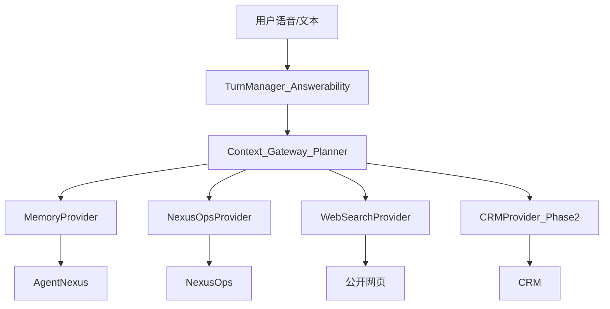

# Workforce 外部系统能力地图

> 语音 Runtime 通过 **Provider** 统一接入第三方系统。  
> LanceDB / Working Memory **不深拷**业务流水；业务事实以各系统为真相源回源查询。  
> 关联：[`realtime-voice-agent-runtime-design.md`](./realtime-voice-agent-runtime-design.md)、[`agentnexus-external-api.md`](./agentnexus-external-api.md)、[`nexusops-external-api.md`](./nexusops-external-api.md)

## 1. 总览

| 系统 | 产品定位 | Phase 1 | 典型问句 |
|---|---|---|---|
| **AgentNexus（智枢）** | 个人/协作记忆与日程 | Mock ✅ | 今天有什么安排？待办有哪些？帮我记住…；我负责什么？ |
| **NexusOps** | 工厂运营（产线/设备/订单/物料/质量/维修） | Mock ✅ | 产线怎么样？M102 故障吗？ORD-… 延误了吗？ |
| **CRM** | 客户/商机/合同 | 占位（Phase 2+） | 这个客户跟进到哪了？ |
| **WebSearch** | 公开时效信息 | ✅ | 天气/新闻/公开资料 |
| **MES/ERP 其它** | 可并入 NexusOps 或独立 Provider | 后续 | — |

## 2. 职责边界（勿混）

| 问题类型 | 查谁 | 不查谁 |
|---|---|---|
| 日程、待办、偏好、角色、个人笔记、「帮我记住」 | **AgentNexus** | NexusOps |
| 产线状态、设备故障、维修工单、订单进度/交期/延误、物料、质量 | **NexusOps** | AgentNexus |
| 客户、线索、商机 | **CRM**（未接） | AgentNexus / NexusOps |
| 天气、新闻、公开网页 | **WebSearch** | 业务系统 |

**允许的交叉引用（指针，不是深拷）**：

- AgentNexus 待办可以说：「跟进产线 A 的 ORD-20260915-01 交期」——实体 ID 作提醒，**进度/是否延误以 NexusOps 为准**。
- NexusOps 结果可提示：「详细交期见订单 ORD-…」；个人偏好仍回 AgentNexus。

## 3. Citation 分层（Runtime 冻结）

| Provider | citation |
|---|---|
| Memory / AgentNexus / Profile | 可无 |
| **NexusOps / CRM / MES / WebSearch** | **必须有**；无 citation 不得当业务事实播报 |

## 4. Planner 路由关键词（示意）

| 命中 | Provider |
|---|---|
| 日程、待办、安排、会议、记住、偏好、兴趣、角色 | `memory`（→ AgentNexus） |
| 产线、设备、订单、交期、延误、故障、维修、工单 WO-、ORD-、物料、质量、OEE、排产 | `nexusops` |
| 客户、商机、合同、跟进（Phase 2） | `crm` |
| 天气、新闻、搜一下… | `websearch` |

多命中时可并行（例如「待办里那张延误订单」→ memory + nexusops）。

## 5. Mock → 真实切换

每个系统独立包 + 独立 `*_MODE` / `*_BASE_URL` / `*_TOKEN`：

| 包 | Mock 前缀 | 切换 |
|---|---|---|
| [`web-demo/agentnexus/`](../web-demo/agentnexus/) | `/agentnexus-mock` | `AGENTNEXUS_MODE=real` |
| [`web-demo/nexusops/`](../web-demo/nexusops/) | `/nexusops-mock` | `NEXUSOPS_MODE=real` |
| CRM | （未实现） | 预留 `CRM_MODE` |

鉴权统一：`Authorization: Bearer <token>`（长期 PersonalToken / API Token）。  
App 登录 session 与外部系统 token **分离**。

## 6. 验收对话（跨系统）

1. 「帮我查一下今天的日程 / 待办」→ **AgentNexus**  
2. 「现在产线情况怎么样？」→ **NexusOps**  
3. 「设备呢？」（追问）→ **NexusOps**（M102 故障 + WO-8842）  
4. 「那这条线上的订单延误了吗？」→ **NexusOps**（ORD-20260915-01）  
5. 「我待办里还有什么要跟的？」→ **AgentNexus**（可点名 ORD/WO，细节仍属 NexusOps）
